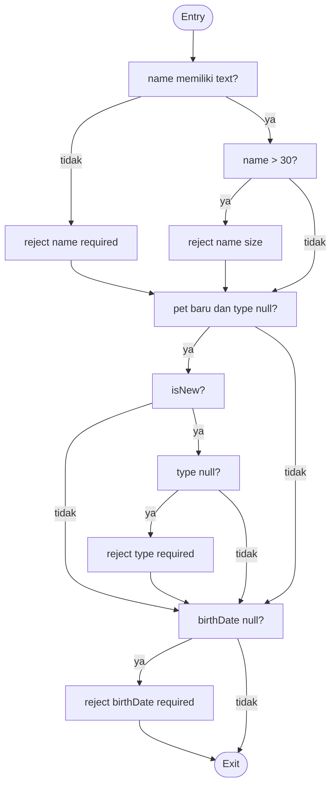

# Analisis White-Box Testing Spring PetClinic

## 1. Ruang lingkup dan baseline

Analisis ini dibuat terhadap source aktual Spring PetClinic yang diambil dari
`spring-projects/spring-petclinic` pada 29 September 2026. Baseline yang
digunakan adalah aplikasi Spring Boot pada `pom.xml` (Java 17, Spring Boot
4.1.0). Fokus pengujian adalah dua unit dengan percabangan paling jelas:

1. `src/main/java/org/springframework/samples/petclinic/owner/PetValidator.java`
2. `src/main/java/org/springframework/samples/petclinic/owner/OwnerController.java`,
   method `processFindForm`

Test yang sudah ada di upstream juga dijadikan bukti eksekusi:
`PetValidatorTests` dan `OwnerControllerTests`. Analisis tidak menganggap CFG
contoh sebagai implementasi program; setiap node di bawah dipetakan ke kondisi
yang benar-benar ada di source.

## 2. Method A: `PetValidator.validate`

### 2.1 Pseudocode aktual

```text
validate(pet, errors)
  name = pet.name
  if name tidak memiliki text
      reject name: required
  else if panjang name > 30
      reject name: size

  if pet masih baru DAN type == null
      reject type: required

  if birthDate == null
      reject birthDate: required
```

`StringUtils.hasText` menganggap `null`, string kosong, dan whitespace-only
sebagai tidak valid. Validasi `type` **tidak** berlaku untuk pet lama karena
kondisinya secara eksplisit memakai `pet.isNew()`. Validasi tanggal lahir hanya
memeriksa nilai `null`; aturan tanggal masa depan berada di
`PetController`, bukan di validator ini.

### 2.2 CFG dan kompleksitas



Untuk CFG dengan short-circuit `&&` (node `isNew` dan `type` dipisah),
`V(G) = 5`: `hasText(name)`, `name.length() > 30`, `isNew()`, `type == null`,
dan `birthDate == null`. Jika alat menghitung kondisi majemuk sebagai satu
predicate, angka ringkasnya adalah 4; basis path di bawah memakai model
short-circuit yang lebih ketat.

### 2.3 Basis path

| Path | Input utama | Hasil yang diharapkan |
|---|---|---|
| P1 | nama valid, pet baru, type ada, tanggal ada | Tidak ada error |
| P2 | nama kosong/whitespace | Error `name=required`; cabang panjang nama tidak dilalui |
| P3 | nama 31 karakter | Error `name=size` |
| P4 | nama valid, pet baru, type null | Error `type=required` |
| P5 | nama valid, pet lama, type null | Tidak ada error type; membuktikan guard `isNew()` |
| P6 | nama valid, type ada, birthDate null | Error `birthDate=required` |

Test upstream yang memetakan path: `validate`, `validateWithInvalidPetName`,
`validateWithLongPetName`, `validateWithInvalidPetType`, dan
`validateWithInvalidBirthDate` pada `PetValidatorTests`. P5 adalah kasus
tambahan yang penting untuk membuktikan detail implementasi yang sering hilang
dalam CFG contoh.

## 3. Method B: `OwnerController.processFindForm`

### 3.1 Pseudocode aktual

```text
lastName = owner.lastName
if lastName == null
    lastName = ""
else
    lastName = lastName.strip()

results = findPaginatedForOwnersLastName(page, lastName)
if results.isEmpty()
    reject owner.lastName: notFound
    return owners/findOwners

if results.totalElements == 1
    owner = satu-satunya hasil
    return redirect:/owners/{id}

return addPaginationModel(page, model, results)
```

### 3.2 CFG dan kompleksitas

```mermaid
flowchart TD
    A([Entry]) --> B[lastName == null?]
    B -- ya --> C[lastName = ""]
    B -- tidak --> D[lastName = strip()]
    C --> E[query paginated]
    D --> E
    E --> F[results empty?]
    F -- ya --> G[reject notFound]
    G --> H[view findOwners]
    F -- tidak --> I[totalElements == 1?]
    I -- ya --> J[ambil owner tunggal]
    J --> K[redirect owner]
    I -- tidak --> L[tambah model pagination]
    H --> M([Exit])
    K --> M
    L --> M
```

Predicate keputusan: `lastName == null`, `isEmpty()`, dan
`getTotalElements() == 1`; maka `V(G) = 3 + 1 = 4`.

### 3.3 Basis path dan test

| Path | Input/fixture | Hasil |
|---|---|---|
| Q1 | `lastName == null`, hasil lebih dari satu | Query dengan prefix kosong; view `ownersList` |
| Q2 | nama berisi whitespace atau spasi di sekitar nama | Nilai di-`strip`; hasil mengikuti query nama bersih |
| Q3 | hasil kosong | Error `lastName=notFound`; view `findOwners` |
| Q4 | tepat satu owner | Redirect ke `/owners/{ownerId}` |

Test upstream yang memetakan Q1-Q4 adalah
`processFindFormSuccess`, `processFindFormIgnoresSurroundingWhitespace`,
`processFindFormWithWhitespaceOnlyLastNameReturnsAllOwners`,
`processFindFormNoOwnersFound`, dan `processFindFormByLastName` pada
`OwnerControllerTests`.

Catatan implementasi: `PageRequest.of(page - 1, 5)` tidak memiliki guard lokal
untuk `page <= 0`; validasi atau exception untuk nilai tersebut berada di
layer framework/repository. Karena itu kondisi tersebut tidak boleh ditambah
sebagai node CFG method ini tanpa perubahan source.

## 4. Ringkasan cakupan dan gap

| Unit | V(G) | Basis path teridentifikasi | Terwakili oleh test upstream |
|---|---:|---:|---|
| `PetValidator.validate` | 5 (strict) | P1-P6 (kombinasi untuk kondisi majemuk) | Ya, kecuali P5 secara eksplisit |
| `OwnerController.processFindForm` | 4 | Q1-Q4 | Ya |

Pengujian white-box di atas mencapai statement coverage untuk node rejection,
return view, redirect, normalisasi input, dan jalur sukses. Untuk meningkatkan
branch coverage, tambahkan test khusus pet lama dengan `type == null` (P5) dan
test langsung `page == 0` bila kontrak endpoint memang ingin menetapkan perilaku
untuk nomor halaman tidak valid. Keduanya adalah rekomendasi pengujian, bukan
pernyataan bahwa source saat ini sudah menangani input tersebut.

## 5. Perintah verifikasi

```text
./mvnw -q -Dtest=PetValidatorTests,OwnerControllerTests test
```

Perintah ini dipilih karena langsung mengeksekusi test yang memetakan CFG
tersebut, tanpa bergantung pada database MySQL/PostgreSQL eksternal.
