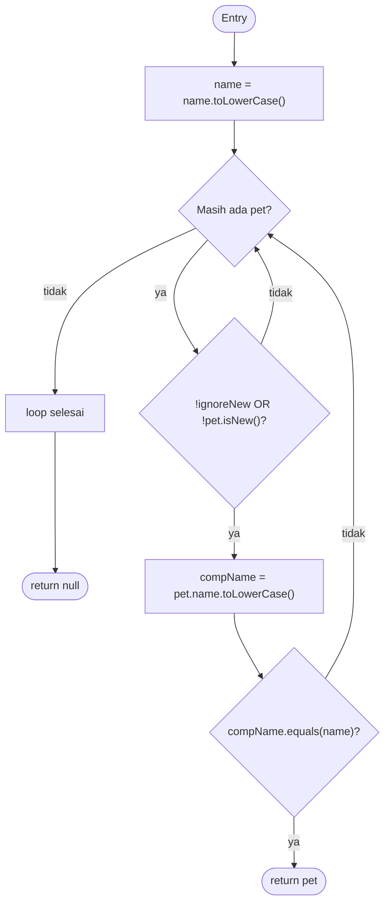

# CFG `Owner.getPet(String name, boolean ignoreNew)`

## Notasi node dan edge

CFG statement-level memakai node berikut. Node N4 adalah satu predicate ringkas
untuk seluruh ekspresi filter; evaluasi operand short-circuit `||` dianalisis
terpisah pada bagian coverage.

| Node | Jenis | Isi |
|---|---|---|
| N1 | Entry | Masuk method |
| N2 | Statement | `name = name.toLowerCase()` |
| N3 | Predicate | Kondisi loop: masih ada elemen pada `getPetsInternal()`? |
| N4 | Predicate | `!ignoreNew || !pet.isNew()` |
| N5 | Statement | `compName = pet.getName(); compName = compName.toLowerCase()` |
| N6 | Predicate | `compName.equals(name)` |
| N7 | Exit | `return pet` |
| N8 | Statement | Loop selesai |
| N9 | Exit | `return null` |

Edge CFG diberi label agar setiap jalur dapat dilacak:

| Edge | Dari → ke | Kondisi |
|---|---|---|
| E1 | N1 → N2 | entry |
| E2 | N2 → N3 | setelah normalisasi |
| E3 | N3 → N4 | iterasi tersedia |
| E4 | N3 → N8 | iterasi habis |
| E5 | N4 → N3 | filter `false`, pet dilewati |
| E6 | N4 → N5 | filter `true` |
| E7 | N5 → N6 | setelah lowercase nama pet |
| E8 | N6 → N7 | nama cocok |
| E9 | N6 → N3 | nama tidak cocok |
| E10 | N8 → N9 | return akhir |

Dengan tiga predicate level-CFG (N3, N4, N6), kompleksitas siklomatiknya:
`V(G) = P + 1 = 3 + 1 = 4`.

## Basis/independent path

Loop dapat berulang, sehingga notasi `N3(T)` berarti satu iterasi tersedia dan
`N3(F)` berarti iterasi selesai.

| Path | Urutan node | Makna |
|---|---|---|
| P1 | N1-N2-N3(F)-N8-N9 | 0 iterasi |
| P2 | N1-N2-N3(T)-N4(F)-N3(F)-N8-N9 | 1 pet baru dilewati |
| P3 | N1-N2-N3(T)-N4(T)-N5-N6(F)-N3(F)-N8-N9 | 1 pet lama, non-match |
| P4 | N1-N2-N3(T)-N4(T)-N5-N6(T)-N7 | 1 pet lama, match dan early return |

Path dengan lebih dari satu iterasi, misalnya
`N3(T)-N4(F)-N3(T)-N4(T)-N5-N6(T)-N7`, merupakan ekstensi loop dari basis
path P2/P4 dan diperlukan untuk loop coverage, bukan basis path baru pada
kompleksitas statement-level.



## Short-circuit `||`

Pada N4, evaluasi aktual adalah:

```text
A = !ignoreNew
if A == true: hasil filter true dan B tidak dievaluasi
else: B = !pet.isNew()
```

CFG ringkas hanya mencatat hasil N4 true/false. Coverage operand A dan B
dilaporkan terpisah agar tidak mengklaim bahwa CFG level-predicate sudah
mencakup detail short-circuit.
